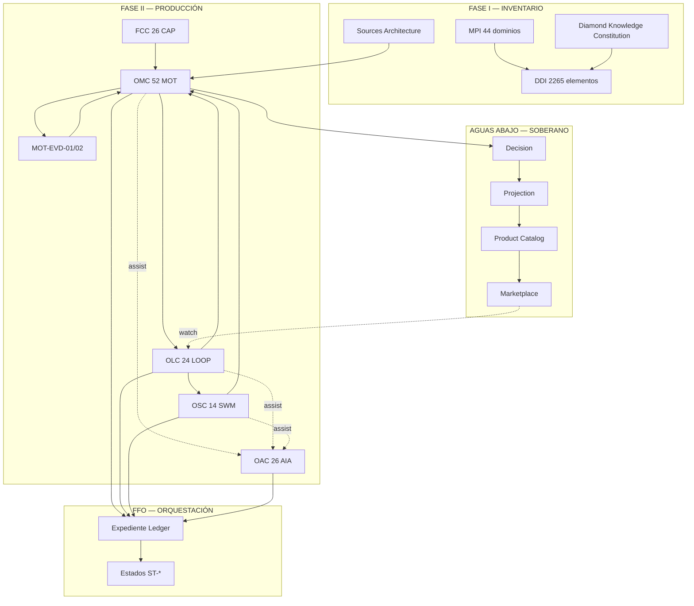

# FULL FACTORY ORCHESTRATION ARCHITECTURE

**Arquitectura de Orquestación Integral de Factory — Auditoría Maestra RealEstateSniper Factory 2.0**

**Autoridad:** Decimonoveno y **último** documento oficial de la Auditoría Maestra. **Constitución Operativa definitiva** de Factory 2.0. Integra y somete a orquestación coherente todos los documentos constitucionales aprobados de Fase I y Fase II.  
**Alcance:** Describir **cómo coopera absolutamente toda la arquitectura** — ciclo de vida del expediente, flujo de evidencia, estados, handoffs, fronteras soberanas y trazabilidad desde nacimiento hasta retirada.  
**Exclusión expresa:** Implementación, programación, código, APIs, proveedores, modelos IA concretos y decisiones de ingeniería.

**Pregunta rectora:**

> *¿Cómo opera Factory 2.0 como sistema constitucional unificado desde el nacimiento de un expediente hasta su retirada — integrando inventario, fuentes, capacidades, motores, loops, enjambres e IA sin usurpar Decision, Projection ni Producto?*

---

## Cierre de la Auditoría Maestra

Este documento **cierra oficialmente** la Auditoría Maestra RealEstateSniper Factory 2.0. A partir de su aprobación:

| Efecto | Enunciado |
|--------|-----------|
| **Canon cerrado** | Fase I (inventario) + Fase II (producción) constitucionalmente completas |
| **Operativa definida** | Factory tiene Constitución Operativa — FFO |
| **Implementación** | Cualquier sistema futuro **obedece** este canon — no lo redefine |
| **Enmienda** | Cambio constitucional = proceso de enmienda Auditoría Maestra |

---

## Canon integrado — 19 documentos oficiales

| # | Documento | Fase | Función en orquestación |
|---|-----------|------|------------------------|
| 1 | **Master Property Intelligence Index** | I | 44 dominios MPI — mapa epistémico |
| 2 | **Diamond Knowledge Constitution** | I | Reglas E/C, Diamond ≠ Premium, Decision gate |
| 3 | **Diamond Data Inventory — Parte I** | I | Identidad, localización, físico |
| 4 | **Diamond Data Inventory — Parte II** | I | Legal, titularidad, gravámenes |
| 5 | **Diamond Data Inventory — Parte III** | I | Propietario, motivación, distress |
| 6 | **Diamond Data Inventory — Parte IV** | I | Finanzas, mercado, valoración |
| 7 | **Diamond Data Inventory — Parte V** | I | Permisos, urbanismo, entorno |
| 8 | **Diamond Data Inventory — Parte VI** | I | Inteligencia operativa, evidencias, Factory |
| 9 | **Diamond Sources & Organisms Architecture** | I–II | Procedencia y frescura |
| 10 | **Master Motors Architecture** | II | Constitución motores |
| 11 | **Factory Capability Catalog** | II | 26 capacidades CAP permanentes |
| 12 | **Official Motor Catalog** | II | 52 motores MOT |
| 13 | **Master Loops Architecture** | II | Constitución loops |
| 14 | **Official Loop Catalog** | II | 24 loops LOOP |
| 15 | **Master Swarms Architecture** | II | Constitución enjambres |
| 16 | **Official Swarm Catalog** | II | 14 patrones SWM |
| 17 | **IA Governance Architecture** | II | Constitución IA asistiva |
| 18 | **Official AI Capability Catalog** | II | 26 capacidades AIA |
| **19** | **Full Factory Orchestration Architecture** | **III** | **Este documento — integración** |

```text
FASE I  — QUÉ            : MPI + DKN + DDI (2.265) + DSO
FASE II — CÓMO PRODUCIR  : FCC → MMA/OMC → MLA/OLC → MSA/OSC → IGA/OAC
FASE III — CÓMO OPERAR   : FFO (este documento)
PRODUCTO — AGUAS ABAJO   : Decision → Projection → Catalog → Marketplace
```

---

# I. Definición constitucional de la orquestación

## I.1 ¿Qué es la Orquestación Factory?

La **Orquestación Factory** es el **marco operativo constitucional** que define:

| Dimensión | Definición |
|-----------|------------|
| **Secuencia** | Orden legítimo de actuación entre capas |
| **Cooperación** | Handoffs, locks y precedencias entre actores |
| **Estados** | Ciclo de vida del expediente (`factory_key`) |
| **Fronteras** | Dónde termina Factory y empieza Decision/Producto |
| **Trazabilidad** | Lineage completo fuente → elemento DDI → evidencia → acto |
| **Gobernanza** | P-CONST, compliance P0, árbitro MOT-EVD |

La orquestación **no es** implementación técnica, workflow engine ni BPMN. Es **constitución operativa**.

## I.2 Actores orquestables (cerrados)

| Actor | Código | Naturaleza | Catálogo |
|-------|--------|------------|----------|
| Fuente | DSO | Procedencia | Sources Architecture |
| Capacidad | CAP | Misión permanente | FCC (26) |
| Motor | MOT | Productor | OMC (52) |
| Evidencia | EVD | Árbitro | MOT-EVD-01/02 |
| Loop | LOOP | Perfeccionador permanente | OLC (24) |
| Enjambre | SWM | Resolvedor temporal | OSC (14) |
| IA asistiva | AIA | Herramienta subordinada | OAC (26) |

**Actores soberanos aguas abajo (fuera orquestación Factory):** Decision · Projection · Product Catalog · Marketplace.

---

# II. Ciclo completo del expediente

## II.1 Diagrama maestro del ciclo

```text
  NACIMIENTO ──► IDENTIFICACIÓN ──► PRODUCCIÓN ──► EVIDENCIAS
        │              │                │              │
        │              │                ▼              │
        │              │         PERFECCIONAMIENTO      │
        │              │            (Loops)           │
        │              │                │              │
        │              │                ▼              │
        │              │         RESOLUCIÓN           │
        │              │         (Enjambres)          │
        │              │                │              │
        │              └──── ASISTENCIA IA (transversal, subordinada)
        │                              │
        ▼                              ▼
  KNOWLEDGE CONSOLIDADO ◄── SYNTHESIS / READINESS
        │
        ▼
  DECISION ──► PROJECTION ──► PRODUCT CATALOG ──► MARKETPLACE
        │
        ▼
  SEGUIMIENTO ──► ACTUALIZACIÓN ──► [REAPERTURA] ──► ARCHIVO ──► RETIRADA
```

## II.2 Estados constitucionales del expediente

| Estado | Código | Descripción | Actores principales |
|--------|--------|-------------|---------------------|
| **Nacimiento** | ST-NASC | Entrada factory — candidato activo | DSO, MOT-CMP-01 |
| **Identificación** | ST-IDN | Resolución factory_key | MOT-IDN, LOOP-FND |
| **Producción** | ST-PROD | Motores producen conocimiento | MOT capas 1–6 |
| **Evidenciación** | ST-EVD | Registro y sufficiency | MOT-EVD-01/02 |
| **Perfeccionamiento** | ST-PERF | Loops activos | LOOP-* |
| **Convergencia** | ST-CONV | Misión SWM temporal | SWM-* |
| **Consolidación** | ST-CONS | Síntesis factory | MOT-SYN, LOOP-INT-RDY |
| **Preparación Decision** | ST-RDY | Readiness PASS | MOT-SYN-02 |
| **Handoff Decision** | ST-DEC | Corpus entregado — Factory pausa decisión | Decision (externo) |
| **Proyección** | ST-PRJ | Projection consume | Projection (externo) |
| **Catálogo** | ST-CAT | Product Catalog empaqueta | Producto (externo) |
| **Mercado** | ST-MKT | Marketplace activo | Marketplace (externo) |
| **Seguimiento** | ST-MON | Monitor post-publicación | LOOP-FRS, MOT event |
| **Actualización** | ST-UPD | Re-perfeccionamiento | Loops + Motores |
| **Archivo** | ST-ARC | Inactivo — ledger preservado | Governance |
| **Retirada** | ST-RET | Cierre definitivo expediente | Registry Authority |

## II.3 Transiciones de estado (reglas)

| Desde | Hacia | Condición |
|-------|-------|-----------|
| ST-NASC | ST-IDN | Candidato válido + CMP clearance |
| ST-IDN | ST-PROD | factory_key resuelto (MOT-IDN-01) |
| ST-PROD | ST-EVD | Knowledge delta material |
| ST-EVD | ST-PERF | Gap, frescura o calidad bajo umbral |
| ST-PERF | ST-CONV | Loop deriva STR-6 / ESC-S |
| ST-CONV | ST-PERF | SWM DIE-* handoff Loop |
| ST-PERF/CONV | ST-CONS | Capas 1–6 suficientes |
| ST-CONS | ST-RDY | MOT-SYN-02 PASS + EVD sufficiency |
| ST-RDY | ST-DEC | Handoff Decision autorizado |
| ST-DEC+ | ST-MON | Post-Decision — Factory en modo watch |
| ST-MON | ST-UPD | ACT-V material o SLA DSO |
| ST-UPD | ST-PERF | Re-apertura perfeccionamiento |
| ST-* | ST-ARC | Decision freeze / deal closed / inactivo |
| ST-ARC | ST-RET | Retención cumplida + acta |

---

# III. Respuestas constitucionales

## III.1 ¿Cómo nace un expediente?

| Paso | Acto | Actor |
|------|------|-------|
| 1 | **Entrada candidata** — dirección, parcel, lead, cohort | Origen comercial/operativo (pre-Factory) |
| 2 | **Compliance gate** — MOT-CMP-01 clearance | LOOP-XVR-CMP-01 |
| 3 | **Asignación factory_key candidato** — provisional | Registry Factory |
| 4 | **Estado ST-NASC** — expediente creado | Factory Orchestration |
| 5 | **Activación LOOP-FND** — supervisión identidad | LOOP-FND-SUP-01 |

**Regla NASC-01:** Sin CMP clearance — no nace expediente productivo.

## III.2 ¿Cómo madura?

Maduración = progresión **ST-IDN → ST-PROD → ST-EVD → ST-PERF → ST-CONS → ST-RDY** con:

1. **Producción motor** por capas 1→6 (OMC pipeline)
2. **Perfeccionamiento loop** continuo o por activador
3. **Convergencia swarm** si complejidad PRB-00
4. **Asistencia AIA** transversal — subordinada
5. **Elevación E/C** solo por motores verificados
6. **Síntesis** MOT-SYN-01 integra corpus
7. **Readiness** MOT-SYN-02 valida gates DKN

**Métrica maduración:** `maturity_score` = f(completeness DDI, C global, sufficiency EVD, readiness SYN-02).

## III.3 ¿Cómo cambia de estado?

| Mecanismo | Descripción |
|-----------|-------------|
| **Activadores** | ACT-T/E/V/D/M/C/R (MLA) — loops y eventos |
| **Motores** | Knowledge delta cambia epistemic state |
| **Loops** | Re-ejecución, STR shift, agotamiento |
| **Enjambres** | SWA-IN/OUT — misión temporal |
| **Evidencia** | Sufficiency fail → downgrade estado |
| **Decision** | Handoff ST-RDY → ST-DEC — externo |
| **Governance** | Archivo/retirada por acta |

**Regla:** Cambio estado **registrado** en `expediente_ledger` — no implícito.

## III.4 ¿Cómo coopera cada capa?

```text
CAPA 0 — DSO        : provee legitimidad ingestión
CAPA A — FUNDACIÓN  : CAP 01–03  → MOT-IDN/LOC/PHY  → LOOP-FND
CAPA B — LEGITIMIDAD: CAP 04–07,25 → MOT-REG/LEG/OWN/LIEN/OCR → LOOP-LEG
CAPA C — DISTRESS   : CAP 08–12,26 → MOT-MOT/CNT/CHR/JUD/LFE/COD → LOOP-DST
CAPA D — ECONOMÍA   : CAP 13–16 → MOT-FIN/HAZ/MKT/INV → LOOP-ECO
CAPA E — ENTORNO    : CAP 17–19 → MOT-CTX/LIV/FUT → LOOP-ENV
CAPA F — INTELIGENCIA: CAP 20–24 → MOT-EVD/SYN/DCN/COM/EXE → LOOP-INT
TRANSVERSAL         : MOT-EVD, MOT-CMP, LOOP-XVR-*
TEMPORAL            : SWM (derivado Loop)
ASISTIVA            : AIA (invocada por MOT/LOOP/SWM)
```

**Cooperación:** Pipeline capas + intercept EVD + derivación SWM + assist AIA.

## III.5 ¿Cómo fluye la evidencia?

```text
Fuente DSO → Motor produce delta → evidence_ref → MOT-EVD-01 registry
                                                      ↓
                                            E0–E4 / C1–C5 asignados
                                                      ↓
                                            Conflicto? → MOT-EVD-02
                                                      ↓
                                            Sufficiency → LOOP-INT-EVD
                                                      ↓
                                            Síntesis MOT-SYN (no eleva E)
                                                      ↓
                                            Decision consume corpus probatorio
```

| Regla | Enunciado |
|-------|-----------|
| **EVF-01** | Toda salida material motor → evidence ref |
| **EVF-02** | IA → `AIA-assist` aux — E1/E2 máximo |
| **EVF-03** | Loop registra re-ejecución en ledger |
| **EVF-04** | SWM vincula swarm_id a lineage |
| **EVF-05** | Conflicto irresoluble bloquea ST-RDY |

## III.6 ¿Cómo se resuelven conflictos?

| Nivel | Actor | Acción |
|-------|-------|--------|
| L1 | MOT-VER | Challenge intra-dominio |
| L2 | LOOP-LEG-EVD / LOOP-XVR-EVD | Pipeline challenge |
| L3 | SWM-EVD-01 | Coordinación multi-dominio |
| L4 | MOT-EVD-02 | Arbitraje mérito — prevalece jerarquía |
| L5 | Evidence Council | Irresoluble declarado |
| L6 | Architecture Board | Patrón/orquestación defectuosa |

**Prohibido:** promediar fuentes (LS-09). Promedio IA (LIA-09).

## III.7 ¿Cómo se calcula preparación para Decision?

**Decision Readiness Formula (conceptual):**

```text
READINESS = f(
  MOT-SYN-02.verdict,
  MOT-EVD-01.sufficiency,
  blockers_C1.count == 0,
  DKN_gates_pass,
  LOOP-INT-RDY-01.FIN-S,
  known_gaps_declared,
  MOT-CMP-01.clearance
)
```

| Gate | Condición |
|------|-----------|
| **G0** | CMP clearance PASS |
| **G1** | factory_key C1–C2 |
| **G2** | Blockers Obl. resueltos o documentados |
| **G3** | EVD sufficiency PASS |
| **G4** | SYN-02 readiness PASS |
| **G5** | Known unknowns Obl. declarados (DKN) |
| **G6** | IC path elements mínimos (si aplica) |

**ST-RDY** solo si G0–G6 PASS (o waiver documentado Council).

## III.8 ¿Cómo se evita la degradación?

| Mecanismo | Actor |
|-----------|-------|
| **Frescura** | LOOP-FRS-* — ACT-T SLA DSO |
| **Perfeccionamiento** | LOOP-SUP/QLT — ACT-E degradación C |
| **Compliance** | LOOP-XVR-CMP-01 — veto continuo |
| **Anti-stale** | LS-10 — fuente vencida degrada C |
| **Watch post-Decision** | ST-MON — LOOP-FRS mínimo |
| **Re-apertura** | ST-UPD ante ACT-V material |
| **No inventar** | Gap declarado > dato ficticio |

## III.9 ¿Cómo se reabre un expediente?

| Condición | Efecto |
|-----------|--------|
| ACT-V material (filing, sale, contacto) | ST-ARC/ST-MON → ST-UPD |
| Agotamiento Loop revocado (evento nuevo) | Línea investigación reabierta |
| Decision reversal (externo) | ST-DEC → ST-RDY re-validación |
| Merge factory_keys | Ledgers fusionados PER-04 |
| Manual acta | Governance Board autoriza |

**Regla REO-01:** Reapertura **no borra** historial — nuevo ciclo en ledger.

## III.10 ¿Cómo se archiva?

| Condición | Estado |
|-----------|--------|
| Deal closed / no-go Decision | ST-ARC |
| Inactividad > SLA expediente | ST-ARC |
| Retención 7 años cumplida | ST-RET |
| Compliance embargo permanente | ST-ARC + embargo flag |

**Preservado:** expediente_ledger, motor manifests, loop ledgers, swarm ledgers, RLG, MOT-EVD-01 registry.

## III.11 ¿Cómo evoluciona con el tiempo?

| Dimensión | Evolución |
|-----------|-----------|
| **Conocimiento** | ST-MON → ST-UPD ciclos FRS |
| **Distress** | Eventos ACT-V → LOOP-DST |
| **Mercado** | MOT-MKT refresh → LOOP-ECO |
| **Entorno** | Census vintage → LOOP-ENV-FRS |
| **IC** | MOT-EXE sync → LOOP-INT-FRS |
| **Constitución** | Enmienda Auditoría — no drift implementación |

## III.12 ¿Cómo se mantiene trazabilidad completa?

**Expediente Lineage Record (ELR):**

```text
ELR-{factory_key}
├── factory_key_history[]
├── state_transitions[]     : ST-* con timestamp y actor
├── motor_manifests[]       : MOT-XX-NN runs
├── loop_ledger_refs[]      : LOOP decisions
├── swarm_mission_refs[]    : SWM SWA-IN/OUT
├── aia_rlg_refs[]          : AIA invocations
├── evidence_registry_ref   : MOT-EVD-01 slice
├── conflict_resolutions[]    : MOT-EVD-02
├── decision_handoffs[]       : ST-RDY → ST-DEC
└── retention_policy          : vida + 7 años
```

**Regla TRZ-01:** Acción sin ELR entry = acción inexistente para auditoría.

---

# IV. Orquestación por fase del ciclo usuario

## IV.1 Nacimiento → Identificación

| Orden | Acto | Documento |
|-------|------|-----------|
| 1 | Validar entrada contra DDI Dominio 01 | MPI, DDI-I |
| 2 | MOT-CMP-01 clearance | OMC, OLC |
| 3 | MOT-IDN-01 resolve / candidato | OMC |
| 4 | LOOP-FND-SUP-01 supervisión | OLC |
| 5 | AIA-NRM-02 assist (opcional) | OAC |
| 6 | factory_key asignado → ST-IDN | FFO |

## IV.2 Producción de conocimiento

| Capa | Secuencia motor | Loop supervisor |
|------|-----------------|-----------------|
| 1 FND | IDN → LOC → PHY | LOOP-FND-* |
| 2 LEG | REG → LEG → OWN → LIEN → OCR | LOOP-LEG-* |
| 3 DST | MOT → CNT → CHR → JUD → LFE → COD | LOOP-DST-* |
| 4 ECO | FIN → HAZ → MKT → INV | LOOP-ECO-* |
| 5 ENV | CTX → LIV → FUT | LOOP-ENV-* |
| 6 INT | EVD → SYN → DCN → COM → EXE | LOOP-INT-* |

**Regla DEP-01..08 (OMC):** dependencias hard respetadas.

## IV.3 Perfeccionamiento (Loops)

- Activador → Loop evalúa → re-ejecuta MOT o escala STR
- Lock LK-01: un motor — un re-ejecutor
- P-CONST precedencia presupuesto
- Agotamiento FIN-X — gap permanece
- Derivación SWM si STR-6

## IV.4 Resolución (Enjambres)

- Loop SWA-IN → SWM nace → coordina MOT → CS/US → SWA-OUT → DIE-* → Loop retoma

## IV.5 Asistencia IA

- Transversal en ST-PROD, ST-PERF, ST-CONV
- Invocación por MOT/LOOP/SWM catalogado
- RLG obligatorio — no altera estados

## IV.6 Knowledge consolidado → Decision

| Paso | Actor |
|------|-------|
| 1 | MOT-EVD-01 sufficiency PASS |
| 2 | MOT-SYN-01 convergence |
| 3 | MOT-SYN-02 readiness PASS |
| 4 | MOT-EXE-01 IC memo (si path IC) |
| 5 | MOT-COM-01 release matrix (pre-Producto) |
| 6 | Handoff corpus → **Decision** |
| 7 | Factory → ST-DEC — no decide |

## IV.7 Decision → Marketplace

| Fase | Soberano | Factory rol |
|------|----------|---------------|
| **Decision** | Decision-Diamond | Provee corpus ST-RDY |
| **Projection** | Projection-Diamond | Consume — Factory no empaqueta |
| **Product Catalog** | Producto | MOT-COM-01 preparó — no publica |
| **Marketplace** | Marketplace | ST-MKT — Factory watch only |

**Regla:** Factory **termina** decisión comercial en ST-DEC handoff.

## IV.8 Seguimiento → Retirada

| Fase | Orquestación |
|------|--------------|
| **Seguimiento** | LOOP-FRS; MOT-CHR event watch |
| **Actualización** | ST-UPD → loops relevantes |
| **Archivo** | ST-ARC — ledgers read-only |
| **Retirada** | ST-RET — cierre ELR |

---

# V. Diagrama constitucional completo

## V.1 Vista integrada (Mermaid)



## V.2 Vista expediente (ASCII)

```text
                    ┌──────────────────────────────────────┐
                    │         CONSTITUCIÓN (MPI+DKN+DDI)    │
                    └──────────────────┬───────────────────┘
                                       ▼
┌──────────┐    ┌──────────┐    ┌──────────┐    ┌──────────┐
│   DSO    │───►│   FCC    │───►│   MOT    │───►│   EVD    │
│ Fuentes  │    │ 26 CAP   │    │ 52 MOT   │    │ 01 / 02  │
└──────────┘    └──────────┘    └────┬─────┘    └────┬─────┘
                                     │               │
                              ┌──────▼──────┐        │
                              │    LOOP     │◄───────┘
                              │  24 LOOP    │
                              └──────┬──────┘
                                     │ derivación
                              ┌──────▼──────┐
                              │    SWM      │
                              │  14 SWM     │
                              └──────┬──────┘
                                     │
         ┌───────────────────────────┼───────────────────────────┐
         │                     AIA (26) — assist only            │
         └───────────────────────────┼───────────────────────────┘
                                     ▼
                         KNOWLEDGE CONSOLIDADO
                         (SYN + EXE + COM prep)
                                     │
                                     ▼
              ┌──────────────────────────────────────────┐
              │  DECISION │ PROJECTION │ CATALOG │ MARKET  │
              └──────────────────────────────────────────┘
                                     │
                                     ▼
                         MON ──► UPD ──► ARC ──► RET
```

---

# VI. Principios permanentes de Factory 2.0

| # | Principio |
|---|-----------|
| **PP-01** | El conocimiento es soberano — el producto lo consume |
| **PP-02** | La evidencia arbitra — no la IA ni el promedio |
| **PP-03** | La identidad precede todo — factory_key es ancla |
| **PP-04** | La calidad precede la velocidad — Loops permanentes |
| **PP-05** | La complejidad justifica Enjambres — no la conveniencia |
| **PP-06** | La IA asiste — nunca decide |
| **PP-07** | Diamond ≠ Premium — caminos separados (DKN) |
| **PP-08** | Factory no asigna access_tier |
| **PP-09** | Gap declarado > dato inventado |
| **PP-10** | Trazabilidad total — ELR obligatorio |
| **PP-11** | Capacidades perduran — motores son sustituibles |
| **PP-12** | Compliance P0 es inviolable |
| **PP-13** | Decision es acto soberano separado |
| **PP-14** | El canon cerrado evoluciona solo por enmienda |
| **PP-15** | Implementación obedece — no redefine |

---

# VII. Prioridades operativas P-CONST (integradas)

```text
P0  Compliance (MOT-CMP-01 / LOOP-XVR-CMP-01)
P1  Identidad (MOT-IDN-01 / LOOP-FND)
P2  Blockers C1 Obl.
P3  Evidencia sufficiency (MOT-EVD-01)
P4  Legitimidad transfer (LOOP-LEG)
P5  Distress auténtico (LOOP-DST-CVG)
P6  Finanzas y valoración (LOOP-ECO)
P7  Síntesis readiness (LOOP-INT-RDY)
P8  Entorno contextual (LOOP-ENV)
P9  Ejecutivo IC (LOOP-INT-FRS)
```

**Regla FFO-P:** Orquestación **siempre** respeta P0→P9 en conflicto recursos.

---

# VIII. Constitución de Orquestación Factory — FFO

| # | Ley |
|---|-----|
| **FFO-01** | FFO es la **Constitución Operativa definitiva** de Factory 2.0 |
| **FFO-02** | FFO **integra** los 19 documentos sin contradecirlos |
| **FFO-03** | El expediente (`factory_key`) es unidad de orquestación |
| **FFO-04** | Estados ST-* son el vocabulario oficial de ciclo de vida |
| **FFO-05** | ELR es obligatorio — trazabilidad total |
| **FFO-06** | Factory **termina** en handoff Decision |
| **FFO-07** | Decision, Projection, Producto son **soberanos** aguas abajo |
| **FFO-08** | Orquestación respeta P-CONST |
| **FFO-09** | MOT-EVD-01/02 interceptan toda producción |
| **FFO-10** | Loops perfeccionan — no producen primario |
| **FFO-11** | Enjambres convergen — son temporales |
| **FFO-12** | IA asiste — subordinada a invocador catalogado |
| **FFO-13** | Reapertura preserva historial |
| **FFO-14** | Archivo preserva ledgers 7 años |
| **FFO-15** | Enmienda FFO = enmienda Auditoría Maestra |
| **FFO-16** | Implementación futura **somete** a FFO |

---

# IX. Leyes finales de la Auditoría Maestra

| # | Ley |
|---|-----|
| **LFF-01** | La Auditoría Maestra Factory 2.0 está **oficialmente cerrada** con FFO |
| **LFF-02** | Ningún sistema futuro puede contradecir el canon integrado |
| **LFF-03** | MPI + DKN + DDI definen **qué** — FFO define **cómo opera** |
| **LFF-04** | 52 motores, 24 loops, 14 SWM, 26 AIA — catálogos cerrados |
| **LFF-05** | 26 capacidades, 44 dominios MPI, 2.265 elementos — cobertura total |
| **LFF-06** | Factory produce conocimiento — Producto monetiza |
| **LFF-07** | Decision es frontera — Factory no la cruza |
| **LFF-08** | Evidencia es árbitro — conflicto no se promedia |
| **LFF-09** | Loops no son reintentos — Enjambres no son IA |
| **LFF-10** | IA no es capa soberana |
| **LFF-11** | Trazabilidad es derecho constitucional del expediente |
| **LFF-12** | Maduración es medible — nominal vacío prohibido |
| **LFF-13** | Post-Marketplace Factory mantiene watch — no abandona |
| **LFF-14** | Retirada es acto governance — no borrado |
| **LFF-15** | Implementación es Fase IV — obedece canon |
| **LFF-16** | Toda enmienda futura preserva espíritu PP-01..15 |
| **LFF-17** | RealEstateSniper Factory 2.0 es **constitucionalmente definido** |
| **LFF-18** | El inventario cerrado no se expande sin enmienda MPI+DDI |
| **LFF-19** | La calidad del conocimiento es el fin — el deal es consecuencia aguas abajo |
| **LFF-20** | Esta Auditoría Maestra es la **autoridad máxima** de arquitectura Factory |

---

# X. Estado oficial de Factory 2.0

## X.1 Inventario constitucional cerrado

| Artefacto | Cantidad | Estado |
|-----------|----------|--------|
| Dominios MPI | 44 / 44 | Cerrado |
| Elementos DDI | 2.265 | Cerrado |
| Partes DDI | 6 / 6 | Cerrado |
| Capacidades CAP | 26 / 26 | Cerrado |
| Motores MOT | 52 | Cerrado |
| Loops LOOP | 24 | Cerrado |
| Patrones SWM | 14 | Cerrado |
| Capacidades AIA | 26 | Cerrado |
| SLOT IA | 10 | Cerrado |
| Documentos Auditoría Maestra | 19 | **Cerrado** |

## X.2 Capas operativas definidas

| Capa | Estado |
|------|--------|
| Fase I — Inventario | ✅ Completa |
| Fase II — Producción | ✅ Completa |
| Fase III — Orquestación | ✅ **FFO — este documento** |
| Fase IV — Implementación | ⏳ Futura — sometida a canon |
| Producto — Decision/Projection/Catalog | 📋 Definido aguas abajo — fuera Factory |

## X.3 Métricas de madurez constitucional

| Dimensión | Valor |
|-----------|-------|
| Documentos oficiales | **19** |
| Leyes acumuladas (todas fases) | **200+** |
| Actores orquestables catalogados | **6 tipos** |
| Estados expediente ST-* | **16** |
| Gates Decision G0–G6 | **7** |
| Principios permanentes PP | **15** |

---

# XI. Conclusiones generales de la Auditoría Maestra

## XI.1 Lo que se ha construido

La Auditoría Maestra RealEstateSniper Factory 2.0 ha producido un **sistema constitucional completo** para la producción de conocimiento inmobiliario de grado institucional:

1. **Inventario cerrado** — 2.265 elementos en 44 dominios MPI sin huecos epistémicos.
2. **Procedencia gobernada** — Sources Architecture con jerarquía probatoria y compliance.
3. **Capacidades estables** — 26 misiones permanentes que sobreviven a cambios tecnológicos.
4. **Producción catalogada** — 52 motores con fichas, dependencias y métricas.
5. **Perfeccionamiento permanente** — 24 loops que maximizan calidad sin confundirse con reintentos.
6. **Convergencia temporal** — 14 enjambres para complejidad genuina multi-actor.
7. **Asistencia IA subordinada** — 26 capacidades con neutralidad tecnológica y prohibiciones absolutas.
8. **Orquestación integral** — FFO une todo en ciclo de vida del expediente.

## XI.2 Lo que se ha evitado

| Anti-patrón evitado | Cómo |
|---------------------|------|
| Factory que decide comercialmente | Frontera ST-DEC |
| IA como capa soberana | IGA + OAC |
| Enjambre como grupo IA | MSA + OSC |
| Loop como cron job | MLA + OLC |
| Motor sin capacidad | FCC + OMC |
| Expansión silenciosa DDI | Ley de no expansión |
| Premium = Diamond | DKN |
| access_tier en Factory | MMA-06, IGA-16 |
| Promedio de evidencias | LS-09, LIA-09 |
| Cobertura nominal vacía | Loops + métricas |

## XI.3 La cadena de valor constitucional

```text
CONOCIMIENTO CALIBRADO (Factory) → DECISIÓN (soberana) → PROYECCIÓN → PRODUCTO → INVERSOR
```

Factory **no vende** — Factory **produce verdad operativa calibrada** sobre activos inmobiliarios con trazabilidad probatoria completa.

## XI.4 Legado de la Auditoría

Este canon constitucional permite:

- Sustituir motores sin perder misión (CAP permanente)
- Sustituir modelos IA sin perder FUN (SLOT neutral)
- Auditar cualquier expediente vía ELR
- Onboardear equipos con vocabulario común ST-*, MOT-*, LOOP-*, SWM-*, AIA-*
- Implementar sistemas que **obedecen** en lugar de improvisar arquitectura

---

# XII. Hoja de ruta — Implementación futura (sin código)

## XII.1 Fase IV — Implementación constitucional

| Orden | Hito | Sometimiento | Entregable conceptual |
|-------|------|--------------|----------------------|
| **IV.1** | **Registry Factory** | FFO ELR, factory_key | Registro expedientes y estados ST-* |
| **IV.2** | **Motor Runtime** | OMC 52 | Ejecución MOT con manifests |
| **IV.3** | **Evidence Service** | MOT-EVD-01/02, DKN | Registry E/C, conflict resolution |
| **IV.4** | **Loop Engine** | OLC 24, MLA | Activadores, STR, ledger |
| **IV.5** | **Swarm Coordinator** | OSC 14, MSA | SWA-IN/OUT, DIE-*, CS/US |
| **IV.6** | **AI Assist Layer** | OAC 26, IGA | AIA invocable, RLG, SLOT |
| **IV.7** | **Orchestration Bus** | FFO | Pipeline capas, P-CONST, handoffs |
| **IV.8** | **Decision Interface** | ST-RDY handoff | API conceptual corpus → Decision |
| **IV.9** | **Watch & Update** | ST-MON/UPD | Post-Marketplace FRS |
| **IV.10** | **Governance Dashboard** | PP, LFF | Métricas madurez, compliance |

## XII.2 Criterios de aceptación implementación

| Criterio | Verificación |
|----------|--------------|
| **Canon compliance** | Ningún actor fuera de catálogo |
| **ELR completeness** | 100% acciones registradas |
| **PRH zero** | Cero violaciones IA |
| **LK-01** | Un motor — un lock |
| **G0–G6** | Gates Decision reproducibles |
| **7yr retention** | Ledgers archivados |
| **Dual-run C** | SLOT sustitución validada |

## XII.3 Orden de implementación recomendado

```text
1. Registry + CMP + IDN (P0, P1)
2. EVD registry (P3)
3. Motores capa 1–2 (fundación + legitimidad)
4. Loops FND + LEG
5. Motores capa 3–4
6. Loops DST + ECO
7. Swarm coordinator
8. Motores capa 5–6 + Loops INT
9. AIA assist layer
10. Orchestration bus completo
11. Decision handoff interface
12. Watch/update post-producto
```

## XII.4 Fuera de alcance Fase IV (explícito)

- Definición Decision-Diamond internals
- Pricing y access_tier Producto
- Marketplace UX
- Selección vendor IA
- Schemas API concretos

---

# Resumen ejecutivo

| Métrica | Valor |
|---------|-------|
| Documento | **19 / 19** — cierre Auditoría Maestra |
| Estados expediente ST-* | **16** |
| Gates Decision G0–G6 | **7** |
| Principios permanentes PP | **15** |
| Leyes FFO | **16** |
| Leyes finales LFF | **20** |
| Actores integrados | DSO · CAP · MOT · EVD · LOOP · SWM · AIA |
| Frontera Factory | Handoff **Decision** (ST-RDY → ST-DEC) |
| Trazabilidad | **ELR** obligatorio |
| Fase IV | Implementación — sometida a canon |

---

## Declaración de cierre

> **La Auditoría Maestra RealEstateSniper Factory 2.0 queda oficialmente cerrada con la aprobación de este documento.**
>
> Factory 2.0 posee Constitución Operativa definitiva. Todo sistema, equipo o implementación futura se somete a este canon. La autoridad máxima de arquitectura Factory reside en los 19 documentos oficiales integrados por FFO.

---

*FULL FACTORY ORCHESTRATION ARCHITECTURE — Arquitectura de Orquestación Integral de Factory. Decimonoveno y último documento oficial de la Auditoría Maestra RealEstateSniper Factory 2.0. Constitución Operativa definitiva del sistema.*
